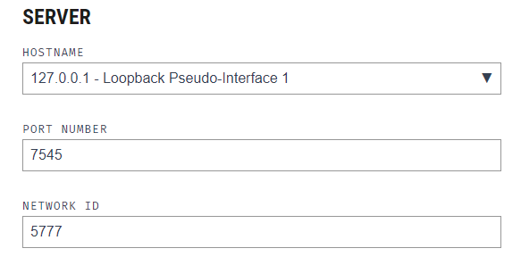
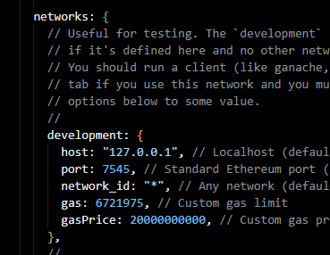
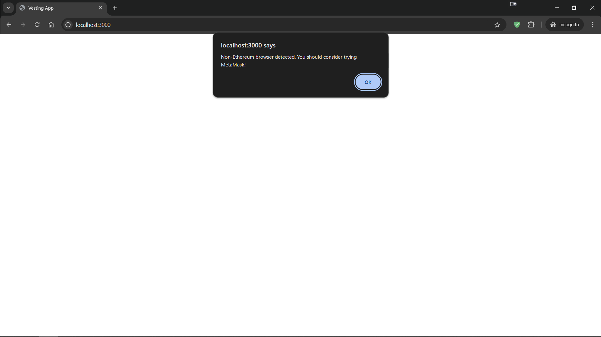
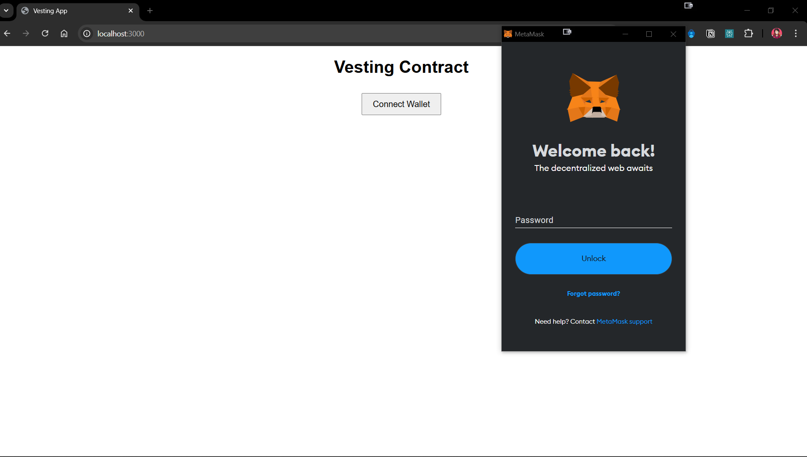

# Vesting Contracts

This is a solidity smart contract which allows the owner to start vesting and manages three roles i.e., Users, Partners, Team.

### project demonstration link: _[youtube unlisted](https://youtu.be/C3vvfBScpH4)_

## Setting up the Environment

**Install Node.js**
Make sure Node.js is installed. This a prerequisite.
**Install truffle**
Installation of Truffle is important as the application is developed with the help of truffle suite.

    npm install -g truffle

**Install all the dependencies**
As the project is build with the help of packages which was developed by the countless developers, its very important to have them to run the program.

    npm install

**Install Ganache**
Ganache which is the part of the truffle family helps us to simulate the ethereum network.
[Install from here](https://archive.trufflesuite.com/ganache/)

#### Note: despite truffle suite getting sunsetted, one can use it for running the project and also can use its other alternatives like hardhat, etc.,

## Compile

Compile the smart contracts to ensure everything works bugfree.

    truffle compile

## Test

Test the code to ensure it passes all the test cases.

    truffle test

**to run the test, you need to open the ganache and start a workspace**

##### note: if the the _'truffle test'_ doesnt work and shows errors check the hosturl, portnumber in _truffle-config.js_ and in _ganache's_ settings like this:

## Run

To run this make sure you followed the above steps correctly and opened up the ganache workspace.

Later run the following command which runs scripts, updates the abi, contractAddress. so that there wouldn't be any issues.

    npm start

